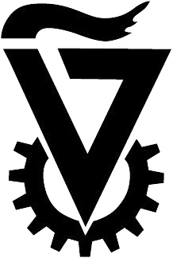

   

    

      

   

  

     

      
      
Home

    

   

  

    

      
      
Call for Participants

    

   

  

    

      
      
Program Schedule

    

  

  

    

      
      
Speakers

    

  

      
About Technion

   

  

<style="display: flex; flex-direction: column; align-items: center; justify-content: space-between">

      
About the Wolfson Department of Chemical Engineering

   

  

  

Welcome to the official website of TCESC! This conference is focused on a broad scope of research practiced in our department i.e. catalysis, energy, material science, polymers, drugs, modeling, microelectronics and sensors, and more.

 

## Event Information

- Date: 1-2/08/2023
- Location: Techion, Haifa, Israel.  
- Registration: [insert registration information]

## Call for Papers

We are currently accepting papers from international speakers. If you are interested in presenting your work, please visit the [Call for Participants](./call-for-Participants.md) page for more information.

## Program Schedule

A detailed program schedule for the conference will be posted closer to the event date. Stay tuned!

## Contact Us

If you have any questions or comments, please do not hesitate to [contact us](mailto:tcesc@campus.technion.ac.il).
