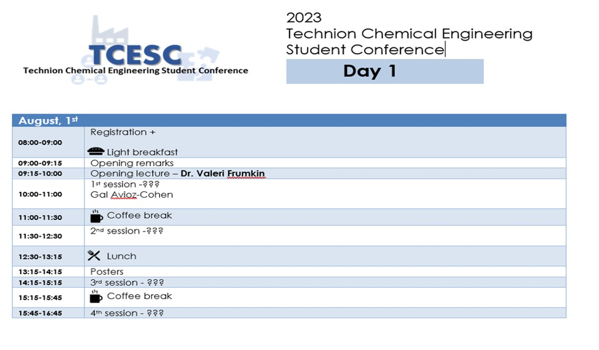
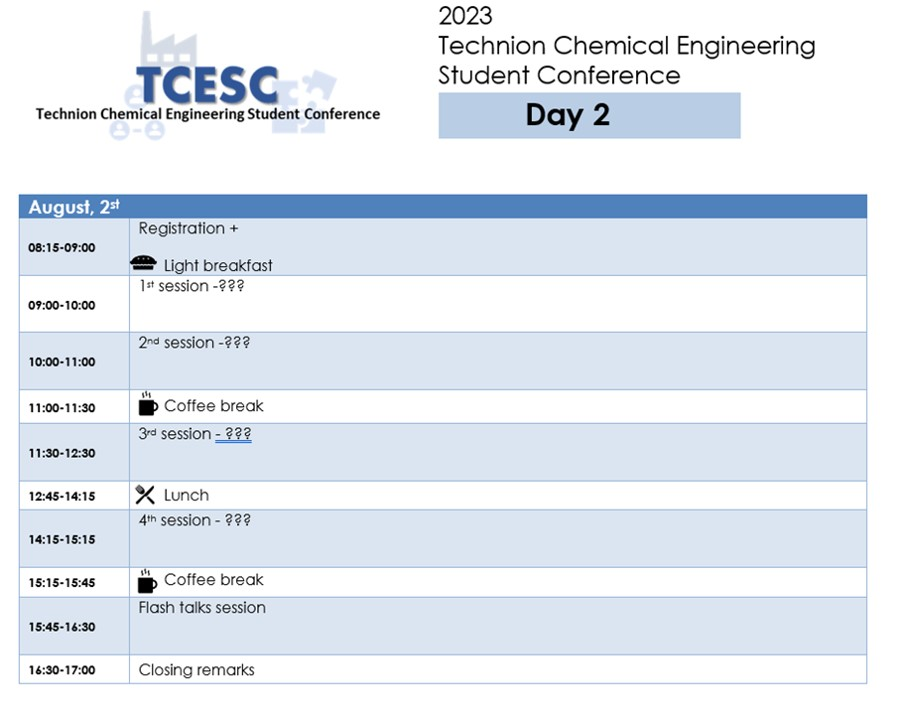

  

    

      
      
Home

    

  

  

    

      
      
Call for Participants

    

  

  

    

      
      
Program Schedule

    

  

  

    

      
      
Speakers

    

  

# August, 1st 2023

# August, 2st 2023

